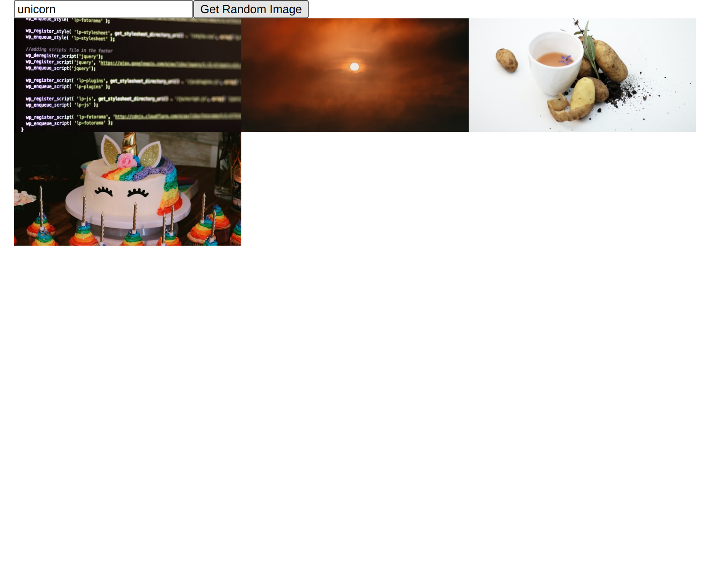

# Unsplash Image Presenter

Develop a small webpage in React presenting images coming from the [Unsplash Source API](https://source.unsplash.com/). You should not have to read the documentation of the API, as all the information you need is provided in this `README`. I recommend reading all of it before jumping in the code.

The webpage will contain 3 main elements:

1. A text field.
2. A "Get Random Image" button.
3. A grid of photos (initially empty).

The user will be able to enter a theme (not required) in the text field (e.g. `nature`, `programming`, `🦄`) and then click the button. After clicking the button, a new image will be added to the photos grid referencing an image from the Unsplash Source API. The image URL should be in the format: `https://source.unsplash.com/{width}x{height}?{theme}` (make sure to replace `{width}`, `{height}` and `{theme}` with the correct values). Here is an example link: [https://source.unsplash.com/800x400?nature](https://source.unsplash.com/800x400?nature).

Here are some other guidelines:

- **Don't** bother styling stuff, unless it is mentioned below. Just make sure that we can interact with the text field and the button easily (decent sizing).
- **Don't** use Bootstrap or any CSS library. The styling asked for is very basic and should be done on your own.
- **Don't** bother about API possible failures or displaying a loading while the image is loading.
- The whole UI should be visible at all time on desktop and mobile (minimally responsive). If there are too many photos shown, there should be a vertical scroll.
- All the page content should be horizontally centered in the screen and not be larger than `1024px`.
- Images should be loaded from the Unsplash API with a size of `600 x 300` pixels.
- On larger screens, the grid should have multiple columns (3 or more). On smaller screens, the number of columns should be dynamically reduced (2 and then 1).
- Structure your code in a readable and maintainable way, but do not over-engineer it neither. Make sure the user can't break the App (unresponsive UI, can't enter anymore theme, etc.). Feel free to leave comments in your code if you are unsure about something.

## Getting Started

Run `yarn install` to install the required packages and then simply run `yarn start` to get started.

## What it should look like

As previously mentioned, styling is very minimal. Here is what we expect the final result to look like (after loading 5 images):

